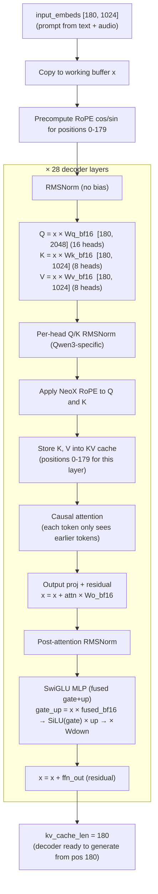

# Decoder Prefill — Detailed Analysis

## What Prefill Does

Prefill processes **all 180 prompt tokens at once** through the 28 decoder layers, building the **KV cache** so that autoregressive generation can start from position 181.

```
input_embeds [180, 1024]  →  28 decoder layers  →  KV cache filled
                                                     (ready to generate)
```

It's like **reading the entire question** before starting to answer — the decoder ingests all the context (system message + audio embeddings + "assistant\n") in one batch.

## Why Prefill Exists — Motivation

### 1. Avoid Redundant Computation (Core Motivation)

Without prefill (naive approach):
```
Generate token 181: process 180 tokens through attention → 1 output
Generate token 182: process 181 tokens through attention → 1 output
Generate token 183: process 182 tokens through attention → 1 output
...
Total compute: 180 + 181 + 182 + ... = O(n²)
```

With prefill:
```
Prefill: process 180 tokens at once → fill KV cache (2,352ms, done ONCE)
Generate token 181: process 1 new token + read cache (~34ms)
Generate token 182: process 1 new token + read cache (~34ms)
...
Total compute: O(n) for prefill + O(1) per generated token
```

Without prefill, generating 21 tokens would cost ~`2,352ms × 21 ≈ 49,392ms`.
With prefill: `2,352ms + 720ms = 3,072ms`. **~16× speedup**.

### 2. Batch Matmul Is More Efficient

Prefill batches 180 tokens into one large matmul:
```
[180, 1024] × [1024, 2048]  ← one big matmul, full CPU cache + SIMD utilization
```

Processing token-by-token would be:
```
[1, 1024] × [1024, 2048]  ← 180 tiny matmuls, each with function call overhead + cache miss
```

Batch matmul has higher arithmetic intensity — better utilization of memory bandwidth.

### 3. Semantic Analogy: "Read the Question Before Answering"

The prompt contains system instructions + audio content + role markers. The decoder must "understand" the entire prompt before it can start generating transcription text. Prefill is this "comprehension" pass.

## The Flow



## Key Dimensions (0.6B Model)

```
dim (hidden_size):    1024
n_heads (Q heads):    16
n_kv_heads (KV heads): 8     (GQA 2:1 — every 2 Q heads share 1 KV head)
head_dim:             128
q_dim:                16 × 128 = 2048  (Q total dim ≠ hidden_size!)
kv_dim:               8 × 128  = 1024  (KV total dim)
intermediate:         3072     (SwiGLU MLP width)
dec_layers:           28
```

## Per-Layer Walkthrough

### Step 1: RMSNorm

```c
qwen_rms_norm(x_norm, x, l->input_norm, seq_len, dim, eps);
```

```
x [180, 1024] → normalize each token → x_norm [180, 1024]

RMSNorm: x / sqrt(mean(x²) + eps) × weight
- Simpler than encoder's LayerNorm — no mean subtraction, no bias
- Only a weight vector [1024], no bias vector
```

### Step 2: QKV Projections (bf16, no bias)

```c
qwen_linear_nobias_bf16(q, x_norm, l->wq_weight_bf16, seq_len, dim, q_dim);
qwen_linear_nobias_bf16(k, x_norm, l->wk_weight_bf16, seq_len, dim, kv_dim);
qwen_linear_nobias_bf16(v, x_norm, l->wv_weight_bf16, seq_len, dim, kv_dim);
```

```
q = x_norm × Wq   [180, 1024] × [1024, 2048] → [180, 2048]  (16 heads × 128)
k = x_norm × Wk   [180, 1024] × [1024, 1024] → [180, 1024]  (8 heads × 128)
v = x_norm × Wv   [180, 1024] × [1024, 1024] → [180, 1024]  (8 heads × 128)

Differences from encoder:
- bf16 weights (not f32) — consumed directly by SIMD kernels
- No bias — decoder QKV has no bias term
- Q is 2048 dims (16 heads) but K/V is 1024 dims (8 heads) — GQA
```

### Step 3: Per-Head Q/K RMSNorm (Qwen3-Specific)

```c
qwen_rms_norm_per_head(q, l->q_norm_weight, seq_len, n_heads, head_dim, eps);
qwen_rms_norm_per_head(k, l->k_norm_weight, seq_len, n_kv_heads, head_dim, eps);
```

```
Q [180, 16 heads, 128 dims]:
  Head 0:  normalize its 128 dims independently
  Head 1:  normalize its 128 dims independently
  ...
  Head 15: normalize its 128 dims independently

Prevents some heads from having much larger magnitudes than others,
which would dominate attention scores unfairly.

This is NOT in standard transformers — it's a Qwen3 addition.
q_norm_weight and k_norm_weight are [128] per layer (one scale per head_dim).
```

### Step 4: RoPE — Inject Position

```c
qwen_apply_rope_neox(q, rope_cos, rope_sin, seq_len, n_heads, head_dim);
qwen_apply_rope_neox(k, rope_cos, rope_sin, seq_len, n_kv_heads, head_dim);
```

```
Rotate Q and K vectors based on position.
Token at position 50 gets rotated by angle 50 × freq.

When Q₁₀₀ · K₅₀ is computed later, the rotation difference
encodes "these are 50 positions apart."

Applied EVERY layer (unlike encoder's sinusoidal PE which is added once).
NeoX split-half style: first 64 dims paired with last 64 dims.
```

### Step 5: Store K, V in KV Cache

```c
for (int s = 0; s < seq_len; s++) {
    memcpy(kv_cache_k_at(ctx, layer, start_pos + s),
           k + s * kv_dim, kv_dim * sizeof(float));
    memcpy(kv_cache_v_at(ctx, layer, start_pos + s),
           v + s * kv_dim, kv_dim * sizeof(float));
}
```

```
KV cache for this layer after prefill:

K: [pos0: 1024 floats][pos1: 1024 floats]...[pos179: 1024 floats][empty...]
V: [pos0: 1024 floats][pos1: 1024 floats]...[pos179: 1024 floats][empty...]
    ↑ stored during prefill                                        ↑ for future tokens

This is the WHOLE POINT of prefill — build this cache so
autoregressive generation doesn't need to reprocess the prompt.
```

### Step 6: Causal Attention

```c
qwen_causal_attention(attn_out, q, full_k, full_v,
                       seq_len, total_seq, n_heads, n_kv_heads,
                       head_dim, scale, start_pos);
```

```
Causal = each token can only attend to itself and EARLIER positions:

Token 0:   sees [0]                      (only itself)
Token 1:   sees [0, 1]
Token 2:   sees [0, 1, 2]
...
Token 179: sees [0, 1, 2, ..., 179]     (sees everything)

Causal mask:
         K: pos0 pos1 pos2 ... pos179
Q pos0:    ✓    ✗    ✗         ✗
Q pos1:    ✓    ✓    ✗         ✗
Q pos2:    ✓    ✓    ✓         ✗
...
Q pos179:  ✓    ✓    ✓    ...  ✓

GQA: 16 Q heads but only 8 K/V heads.
  Q head 0, 1  → read from KV head 0
  Q head 2, 3  → read from KV head 1
  ...
  Q head 14, 15 → read from KV head 7
```

### Step 7: Output Projection + Residual

```c
qwen_linear_nobias_bf16(proj_out, attn_out, l->wo_weight_bf16,
                         seq_len, q_dim, dim);
qwen_add_inplace(x, proj_out, seq_len * dim);
```

```
attn_out [180, 2048] × Wo [2048, 1024] → proj_out [180, 1024]
(compress from 16-head output back to hidden dim)

x = x + proj_out  (residual connection)
```

### Step 8: SwiGLU MLP

```c
qwen_rms_norm(x_norm, x, l->post_attn_norm, seq_len, dim, eps);

qwen_linear_nobias_bf16(gate_up, x_norm, l->gate_up_fused_bf16,
                         seq_len, dim, 2 * intermediate);
qwen_swiglu_multiply(gate, gate_up, seq_len, intermediate);
qwen_linear_nobias_bf16(ffn_out, gate, l->down_weight_bf16,
                         seq_len, intermediate, dim);

qwen_add_inplace(x, ffn_out, seq_len * dim);
```

```
SwiGLU differs from encoder's GELU FFN:

Encoder: x → fc1 [896,3584] → GELU → fc2 [3584,896] → out
Decoder: x → fused [1024,6144] → SiLU(gate) × up [180,3072] → down [3072,1024] → out

SwiGLU has a "gate" that controls how much information passes through:
  gate_up = x × fused_weight     → [180, 6144]  (gate and up interleaved)
  gate = SiLU(gate_part) × up_part → [180, 3072]  (gated output)
  ffn_out = gate × Wdown          → [180, 1024]  (project back)

The fused gate+up weight interleaves rows:
  [gate_row0, up_row0, gate_row1, up_row1, ...]
  → one matmul produces both gate and up, halving memory traffic
```

### After All 28 Layers

```c
ctx->kv_cache_len = start_pos + seq_len;   // 0 + 180 = 180
```

## KV Cache State After Prefill

```
28 layers × 180 positions × 1024 dims × 2 (K+V) × 4 bytes
= 28 × 180 × 1024 × 2 × 4
= 41.3 MB

KV cache layout:
  Layer 0:  K[pos0..pos179], V[pos0..pos179]
  Layer 1:  K[pos0..pos179], V[pos0..pos179]
  ...
  Layer 27: K[pos0..pos179], V[pos0..pos179]
```

## Encoder vs Decoder — Side by Side

| | Encoder (18 layers) | Decoder Prefill (28 layers) |
|---|---|---|
| Input | [166, 896] from Conv2D | [180, 1024] from prompt assembly |
| Norm | LayerNorm (with bias) | RMSNorm (no bias) |
| QKV weights | f32, with biases | bf16, no biases |
| Q/K heads | 14 Q, 14 KV (equal) | 16 Q, 8 KV (GQA 2:1) |
| Extra Q/K norm | No | Per-head RMSNorm (Qwen3-specific) |
| Position | Sinusoidal PE (added once before) | RoPE (applied every layer) |
| Attention | Bidirectional windowed | Causal (masked) |
| FFN | fc1 → GELU → fc2 (biased) | SwiGLU fused gate+up (no bias) |
| KV cache | No | Yes — the whole point |
| Time | 1,155ms | 2,352ms |

## Why Prefill Is Expensive (2,352ms)

28 layers, each doing multiple bf16 matmuls on 180 tokens:

```
Per layer:
  Q projection:  [180, 1024] × [1024, 2048]  bf16 matmul
  K projection:  [180, 1024] × [1024, 1024]  bf16 matmul
  V projection:  [180, 1024] × [1024, 1024]  bf16 matmul
  Output proj:   [180, 2048] × [2048, 1024]  bf16 matmul
  Gate+up fused: [180, 1024] × [1024, 6144]  bf16 matmul  ← largest!
  Down proj:     [180, 3072] × [3072, 1024]  bf16 matmul

  ~84ms per layer × 28 layers = ~2,352ms
```

But it only happens **once** per audio. After prefill, autoregressive generation processes 1 token at a time (34ms each), reading from the cached K/V instead of reprocessing the entire prompt.
