# Qwen3-ASR Pure C Inference Engine — Architecture Deep Dive

## 1. High-Level System Architecture

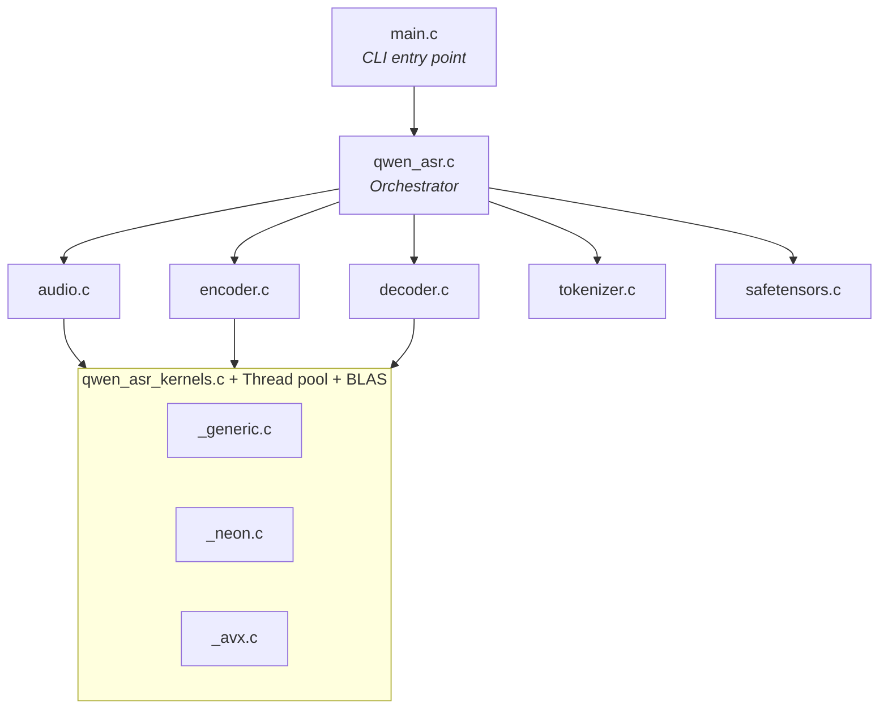

## 2. The Complete Inference Pipeline

This is the **exact data flow** for a single audio → text conversion:

```mermaid
flowchart TD
    IN(["WAV / stdin / raw PCM"])

    subgraph A["qwen_asr_audio.c"]
        A1["Parse WAV → s16→f32 → Resample 16kHz → Skip silence"]
    end

    subgraph M["Mel Spectrogram"]
        M1["Reflect-pad → Hann → DFT 400pt → 128 mel bins<br>Dynamic-max clamp → log10 normalize → <b>[128, T]</b>"]
    end

    subgraph E["qwen_asr_encoder.c"]
        E1["<b>Conv2D Stem</b> (per-chunk)<br>3×Conv2D 3x3 s=2 GELU → Reshape → Linear<br>+ Sinusoidal PE (per-chunk, resets pos=0)"]
        E2["Concat chunks → <b>[total_tok, d_model]</b>"]
        E3["<b>Windowed Transformer</b> ×L<br>LayerNorm → QKV (biased) → Bidir attn (win=104)<br>→ residual → LayerNorm → FFN GELU → residual"]
        E4["LayerNorm → proj1 → GELU → proj2<br>→ <b>[T', output_dim]</b>  T'≈T/8"]
        E1 --> E2 --> E3 --> E4
    end

    subgraph P["Prompt Assembly — qwen_asr.c"]
        P1["‹im_start›system [prompt] ‹im_end›<br>‹im_start›user ‹audio_start›<br><b>[ENCODER EMBEDDINGS]</b><br>‹audio_end›‹im_end› ‹im_start›assistant<br>→ embed all via bf16 tok_embeddings"]
    end

    subgraph D["qwen_asr_decoder.c"]
        D1["<b>Prefill</b>: full prompt → KV cache"]
        D2["<b>Autoregressive Loop</b><br>RMSNorm → QKV bf16 → per-head Q/K RMSNorm<br>→ NeoX RoPE → GQA causal attn (2:1)<br>→ SwiGLU MLP bf16 (fused gate+up)<br>→ streaming argmax (no logits buffer, tied weights)<br>→ greedy token → callback → until EOS"]
        D1 --> D2
    end

    subgraph T["qwen_asr_tokenizer.c"]
        T1["GPT-2 BPE decode → text"]
    end

    IN --> A1 --> M1 --> E1
    E4 --> P1 --> D1
    D2 --> T1
```

## 3. Encoder vs Decoder — The Critical Differences

The encoder and decoder are **architecturally very different**, even though both are "transformers":

| | **Audio Encoder** | **LLM Decoder (Qwen3)** |
|---|---|---|
| **Norm** | LayerNorm (with bias) | RMSNorm (no bias) |
| **QKV** | f32, with biases | bf16, no biases + per-head Q/K RMSNorm |
| **Attention** | Bidirectional windowed | Causal GQA (2:1 heads:kv_heads) |
| **Position** | Sinusoidal (per chunk) | NeoX RoPE (split-half) |
| **FFN** | fc1 → GELU → fc2 (biased) | SwiGLU (bf16, no biases) |
| **Weights** | f32 (converted at load) | bf16 (mmap'd direct) |
| **Layers** | 24 or 18 | 28 |
| **Hidden** | 1024 or 896 | 2048 or 1024 |

## 4. Memory Layout & Weight Storage Strategy

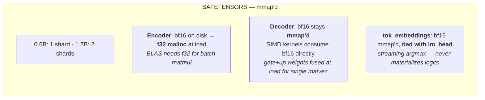

## 5. The Three Transcription Modes

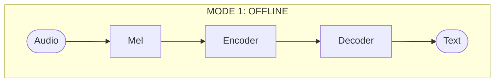

> Simplest path. Best quality for < 60s audio.

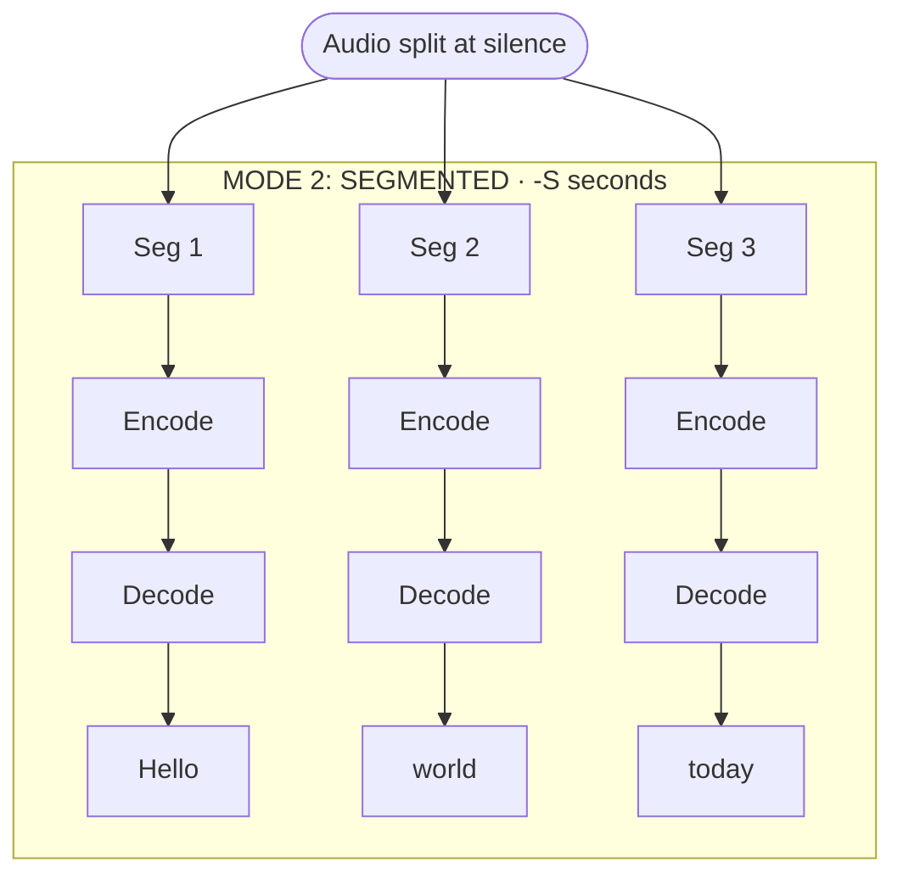

> `--past-text yes`: each segment conditions on prior text. Anti-collapse retry if output too short.

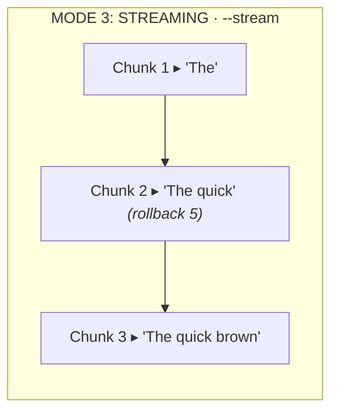

> **Encoder cache** (only re-encode tail window) · **Prefill reuse** (skip unchanged KV) · **Rollback** (last 5 tokens unfixed) · **Monotonic commit** (never retract).

## 6. Kernel Dispatch Architecture

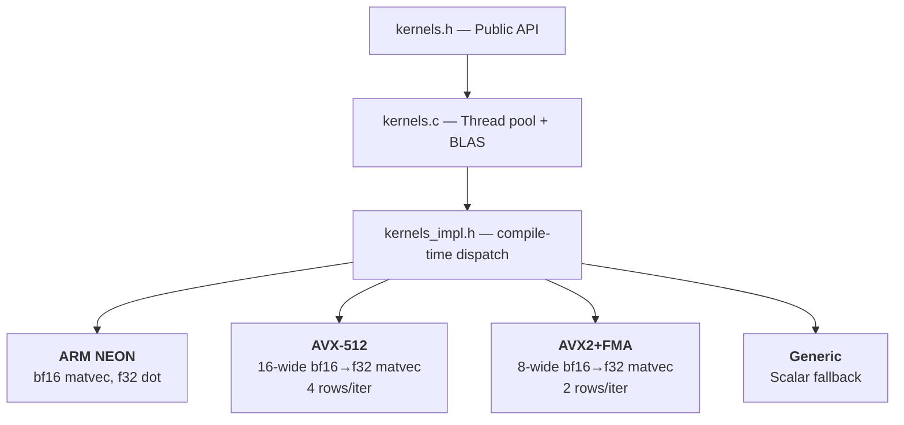

> **Decode bottleneck:** `qwen_bf16_matvec_fused` (memory-bound bf16×f32) + `qwen_argmax_bf16_range` (streaming argmax, no 600KB logits buffer).
> **Encode bottleneck:** `cblas_sgemm` (f32 batch matmul via BLAS).

## 7. KV Cache Design

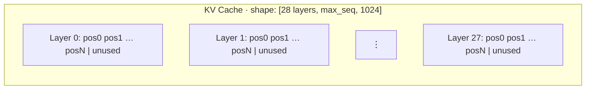

> Grows by doubling · Reset between segments · Partially reused in streaming · GQA: 8 KV heads serve 16 Q heads.

## 8. The Prompt Token Layout (Decoder Input)

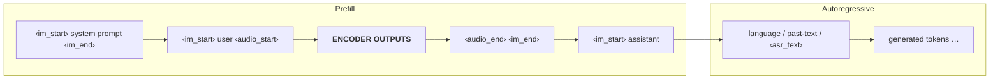

## 9. Model Variant Auto-Detection

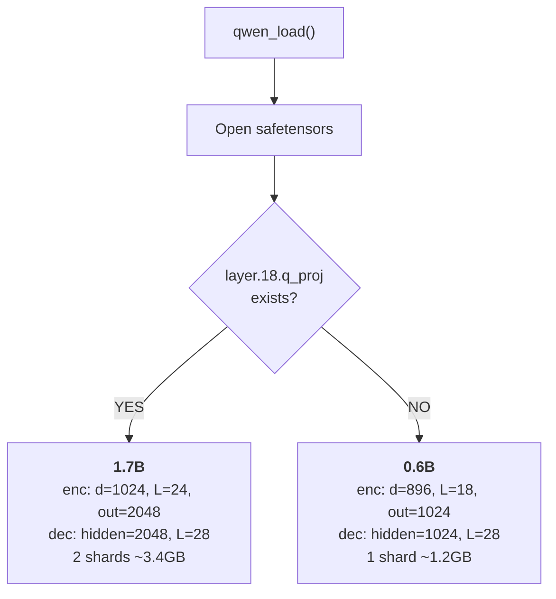

## 10. Threading Model

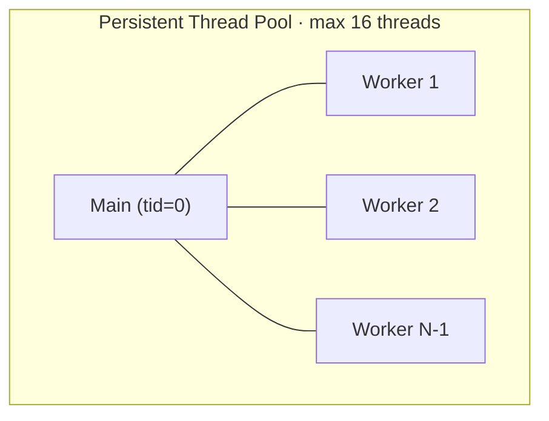

> `qwen_parallel_for`: broadcast → main runs tid=0 → wait all workers.
> Parallelized: bf16 matvec (row-range) · argmax (range) · QKV (fused) · attention (head partitioning).
> BLAS uses its own separate OpenBLAS thread pool.

## 11. Audio Processing Details

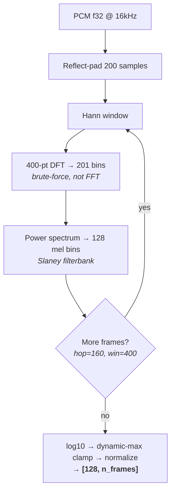

> **vs Whisper:** Whisper uses fixed `log_mel_max=1.5`. Qwen3-ASR uses dynamic maximum per utterance.

## 12. Streaming Internals (the complex part)

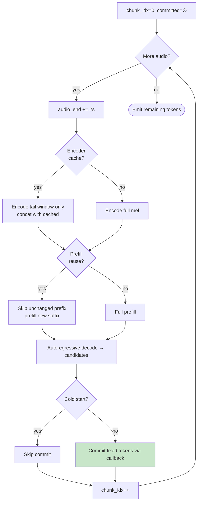

> **Invariant:** committed text is monotonic — never retract emitted text.

## 13. File-Level Dependency Graph

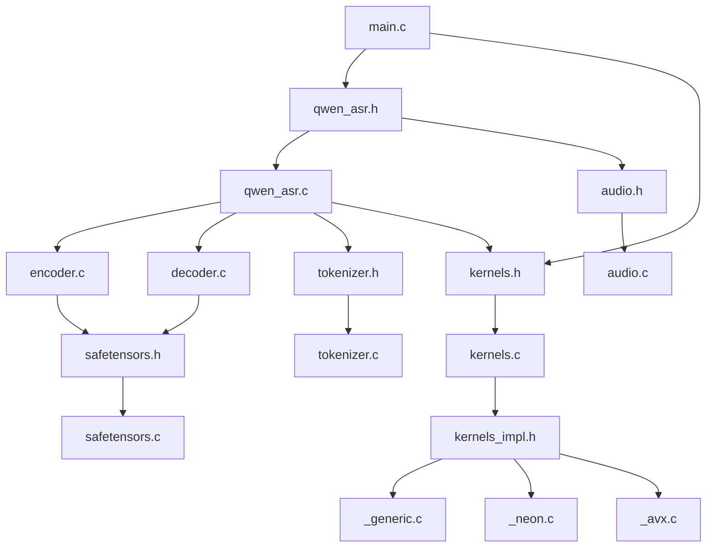

## 14. Key Design Decisions & Why

| Decision | Why |
|----------|-----|
| **bf16 mmap decoder, f32 malloc encoder** | Decoder does matvecs (SIMD bf16). Encoder does batch matmul (BLAS needs f32). |
| **Fused gate+up weights** | One matvec instead of two for SwiGLU. Halves memory traffic. |
| **Streaming argmax** | No 600KB logits buffer. Argmax while scanning rows. |
| **Tied embeddings** | `lm_head = tok_embeddings^T`. Saves ~300MB. |
| **Per-chunk sinusoidal PE** | Chunks are independent — each starts at pos=0. |
| **Brute-force DFT** | N=400 is small enough. Simpler than FFT. |
| **NeoX RoPE (split-half)** | `[x[:h]*cos - x[h:]*sin, x[:h]*sin + x[h:]*cos]` |
| **Persistent thread pool** | Avoids pthread_create/join per op. Workers sleep on condvar. |
