# Qwen3-ASR Inference — Step-by-Step Analysis

This document follows the **exact inference order**: model loading → audio input → mel spectrogram → encoder (Conv2D stem → transformer) → prompt assembly → decoder (prefill → autoregressive) → tokenizer → text output.

## 1. Model Loading

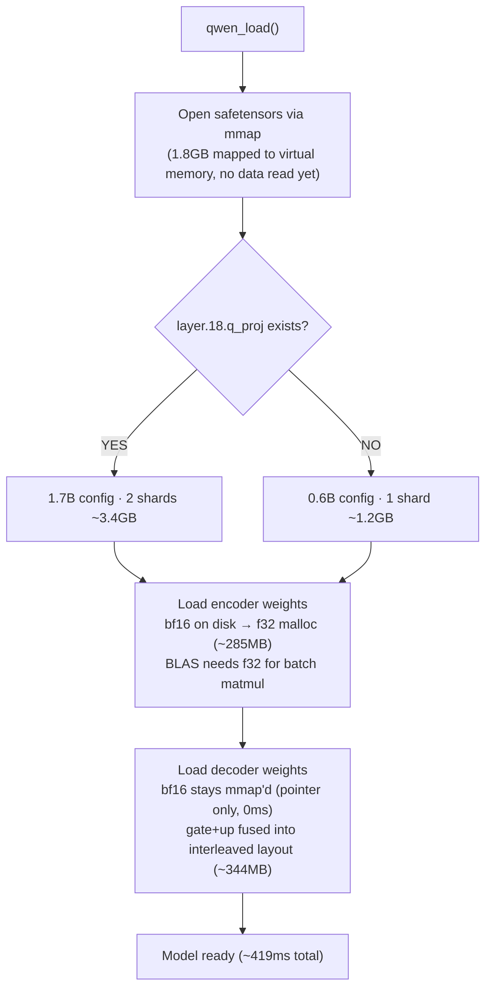

Encoder weights are **converted** bf16→f32 at load (BLAS needs f32). Decoder weights stay as **mmap'd bf16 pointers** — SIMD kernels consume bf16 directly. The gate+up weight fusion interleaves rows for a single matvec instead of two during decode.

## 2. Audio Input

Source: `qwen_asr_audio.c`

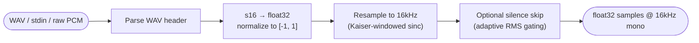

Input must be mono 16kHz. If not, the loader resamples. Output: a flat array of float32 samples in [-1.0, 1.0].

## 3. Mel Spectrogram

Source: `qwen_asr_audio.c` → `qwen_mel_spectrogram()`

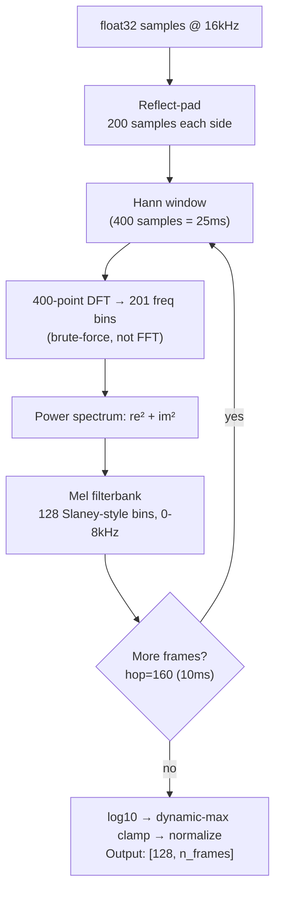

For 12.76s audio → **1,276 mel frames** (one every 10ms). Each frame is a 128-dim vector (128 mel frequency bins). The mel filterbank uses **Slaney-style** spacing: linear below 1kHz, logarithmic above — matching human pitch perception (Weber-Fechner law).

Unlike Whisper (fixed `log_mel_max=1.5`), Qwen uses **dynamic maximum** per utterance for clamping.

## 4. Encoder: Conv2D Stem

Source: `qwen_asr_encoder.c` → `qwen_encoder_forward()`, first half

The mel spectrogram [128, 1276] is too large for the transformer (attention is O(n²)). The Conv2D stem **compresses it 8×** into a short token sequence.

### 4.1 Split Into Chunks

The mel is split into chunks of 100 frames (= 1 second). Each chunk is processed independently:

```
Chunk  1: frames 0-99       (1 second)
Chunk  2: frames 100-199    (1 second)
...
Chunk 12: frames 1100-1199  (1 second)
Chunk 13: frames 1200-1275  (0.76 seconds, 76 frames)
```

### 4.2 Three Conv2D Layers Per Chunk

Each Conv2D layer slides a 3×3 kernel with stride=2, halving both frequency and time dimensions:

```
Input:        [128 freq, 100 time]     1 channel (raw energy)
After Conv1:  [64 freq,  50 time]     480 channels (480 learned pattern detectors)
After Conv2:  [32 freq,  25 time]     480 channels (refined patterns)
After Conv3:  [16 freq,  13 time]     480 channels (high-level patterns)
```

Conv2D extracts local audio features — each of the 480 kernels (3×3 learned weights) detects a different pattern (pitch edges, formant peaks, energy onsets, etc.).

### 4.3 Reshape + Linear Projection

Flatten the 3D output and compress to d_model:

```
[480 channels, 16 freq, 13 time]
        ↓ Reshape: stack channels × freq at each time step
[13 time steps, 7680 features]     (480 × 16 = 7680)
        ↓ Linear projection: × Weight[7680, 896]
[13 tokens, 896 dims]              (compressed to d_model)
```

The 7680→896 linear projection is a learned compression — 6.8M weights trained to extract the essential information from 7680 raw features into 896 dimensions.

### 4.4 Sinusoidal Position Embedding

Each chunk's tokens get a position stamp (per-chunk, starting from pos=0):

```c
// For each position p and dimension d:
angle = p * exp(-d * log(10000) / (448-1))    // 448 different frequencies
pe[p][d]       = sin(angle)                    // first 448 dims: sin
pe[p][d + 448] = cos(angle)                    // last 448 dims: cos
```

448 sin + 448 cos = 896 dims. Fast dimensions change rapidly (distinguish nearby positions), slow dimensions change slowly (distinguish distant positions). Sin+cos together provide a unique fingerprint for each position and enable the transformer to compute relative distances via linear transform.

Position embedding is **added** to the projected tokens: `token = audio_features + position_encoding`.

### 4.5 Concatenate All Chunks

```
Chunk  1 → 13 tokens   ─┐
Chunk  2 → 13 tokens    │
...                      ├→ concatenate → [166 tokens, 896 dims]
Chunk 12 → 13 tokens    │
Chunk 13 → 10 tokens   ─┘
```

## 5. Encoder: Attention Window Boundaries

Before the transformer runs, token boundaries are computed for **windowed attention**:

```c
window_token_size = 13 * (800 / 100) = 104 tokens    // ~8 seconds of audio
n_windows = ceil(166 / 104) = 2
window_starts = [0, 104, 166]
```

```
Window 0: tokens 0-103      (~8 seconds)    tokens can attend to each other ✓
Window 1: tokens 104-165    (~4.7 seconds)  tokens can attend to each other ✓
Cross-window: token 50 → token 120          blocked ✗
```

This restricts attention to O(n × w) instead of O(n²). For audio < 8 seconds, everything fits in one window (equivalent to global attention).

## 6. Encoder: Transformer Layers (×18)

Source: `qwen_asr_encoder.c`, transformer loop

18 identical layers, each refining the token representations. Each layer has two blocks:

### 6.1 Self-Attention Block (~21ms per layer)

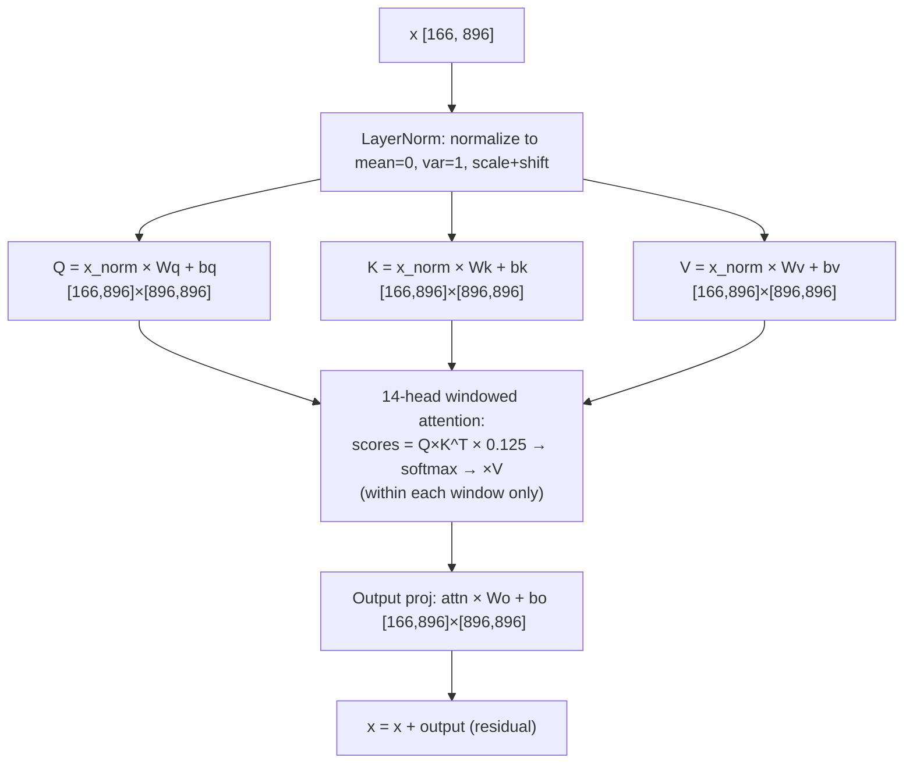

**Q, K, V**: three projections from the same input. Q = "what am I looking for?", K = "what do I contain?", V = "what info do I offer?". Each token computes attention scores `Q·K^T` against all tokens in its window, then gathers a weighted sum of V values.

**Multi-head**: Q, K, V are split into 14 heads of 64 dims each. Each head focuses on different aspects (pitch, energy, timing, formants...). All 14 outputs are concatenated back to 896 dims.

**Scale factor** `1/√64 = 0.125` prevents dot products from becoming too large before softmax.

**Residual connection** `x = x + output` preserves original information while adding new context. If attention has nothing useful to add, it can output near-zero and pass through unchanged.

### 6.2 FFN Block (~42ms per layer)

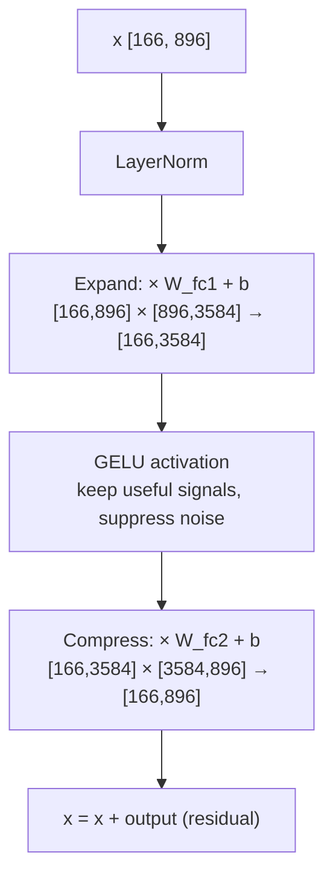

FFN expands to 4× width (896→3584), applies GELU nonlinearity, then compresses back (3584→896). The expansion gives room to compute complex transformations. GELU between the two linear layers prevents them from collapsing into a single linear operation.

FFN costs 2× more than attention because ffn_dim=3584 is 4× larger than d_model=896.

### 6.3 How 18 Layers Build Understanding

```
Layer  1-3:  Detect phonemes, pitch edges, energy onsets
Layer  4-8:  Recognize syllable boundaries, formant transitions
Layer  9-14: Understand words, short phrases, coarticulation
Layer 15-18: Resolve ambiguity using full context within windows

Example for "网络故障" (network fault):
  After layer 3:  [wang] [luo] [gu] [zhang]  — raw phonemes
  After layer 10: [wangluo] [guzhang]         — words forming
  After layer 18: [网络] [故障]                — full context, ready for decoder
```

### 6.4 Computational Cost

| Operation | Shape | Multiply-adds | Time |
|-----------|-------|--------------|------|
| Q, K, V, Out projections (×4) | [166,896]×[896,896] | 4 × 133M = 532M | ~16ms |
| Attention scores+gather | [166,64]×[64,166] ×14 heads | 18M | ~3ms |
| FFN fc1 (expand) | [166,896]×[896,3584] | 533M | ~20ms |
| FFN fc2 (compress) | [166,3584]×[3584,896] | 533M | ~20ms |
| **Layer total** | | **~1,616M** | **~62ms** |

18 layers: **~29 billion multiply-adds → 1,155ms**

## 7. Encoder: Final Projection

```
x [166, 896]  →  LayerNorm  →  × proj1 [896,896] + GELU  →  × proj2 [896,1024]  →  [166, 1024]
```

Changes dimension from encoder's d_model=896 to decoder's hidden_size=1024. The encoder is done.

## 8. Prompt Assembly

Source: `qwen_asr.c` → `transcribe_segment()`

The encoder output [166, 1024] is spliced into a chat-style prompt:

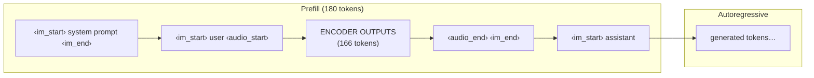

All text tokens are embedded via `tok_embeddings` (bf16). The encoder output embeddings **replace** the `‹audio_pad›` placeholder positions. Total prompt: ~181 tokens.

## 9. Decoder: Prefill

Source: `qwen_asr_decoder.c` → `qwen_decoder_prefill()`

Feed all 180 prompt tokens (everything except the last) through 28 decoder layers at once, populating the **KV cache**:

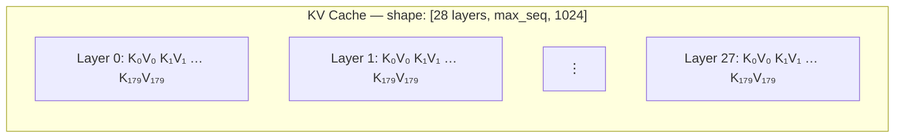

Each decoder layer:

```
RMSNorm → QKV (bf16, no bias) → per-head Q/K RMSNorm → NeoX RoPE
→ Causal GQA attention (16 Q heads, 8 KV heads, 2:1 ratio)
→ Output proj → residual
→ RMSNorm → SwiGLU MLP (bf16, fused gate+up) → residual
```

Key differences from encoder:
- **RMSNorm** (no bias) instead of LayerNorm (with bias)
- **Causal** attention (can only look backward) instead of bidirectional
- **GQA** (8 KV heads serve 16 Q heads) instead of MHA (all heads equal)
- **RoPE** (rotary position embedding at every layer) instead of sinusoidal PE (added once)
- **SwiGLU** MLP instead of GELU FFN
- **bf16 weights** consumed directly via SIMD instead of f32

Prefill processes all 180 tokens in batch → fills KV cache. Then the last token generates the first output token via greedy argmax.

## 10. Decoder: Autoregressive Generation

Source: `qwen_asr_decoder.c` → `qwen_decoder_forward()`, called in loop from `qwen_asr.c`

One token at a time — embed previous token, run through 28 layers, pick next token:

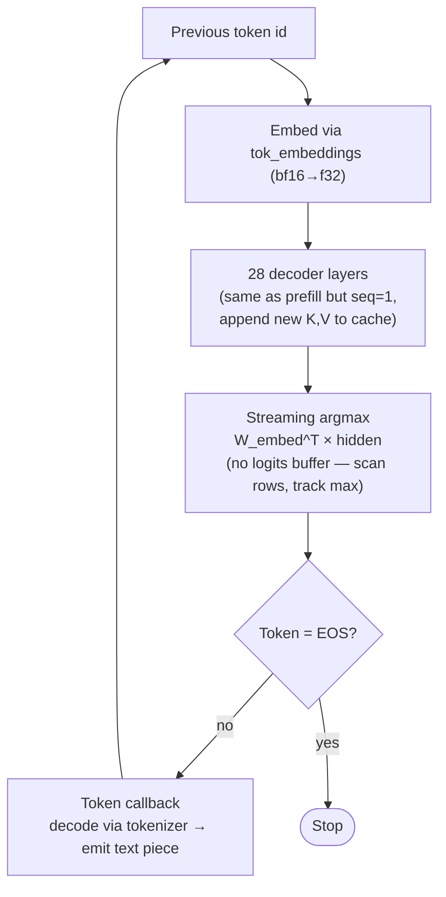

**Streaming argmax**: instead of materializing a 151,936-float logits vector (600KB), it computes `dot(hidden, embedding_row)` for each vocab row and tracks the maximum. Saves memory and cache pressure.

**Tied weights**: `lm_head = tok_embeddings^T` — the same weight matrix used for embedding is reused for the final logits projection. Saves ~300MB.

For 12.76s audio → **21 output tokens** at ~34ms/token = 720ms.

## 11. Tokenizer

Source: `qwen_asr_tokenizer.c`

GPT-2 byte-level BPE. Each generated token id is looked up in `vocab.json` (151,936 entries) and decoded through the byte-to-unicode reverse mapping to produce UTF-8 text.

The model outputs in the format: `language English<asr_text>The actual transcription.<|im_end|>`. The code splits on `<asr_text>` and returns the text after it.

## 12. End-to-End Summary

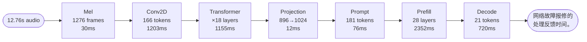

| Phase | Time | % |
|-------|------|---|
| Mel spectrogram | 30ms | 0.5% |
| Encoder Conv2D stem | 1,203ms | 21.6% |
| Encoder Transformer ×18 | 1,155ms | 20.7% |
| Encoder projection | 12ms | 0.2% |
| Tokenizer load | 76ms | 1.4% |
| Decoder Prefill | 2,352ms | 42.3% |
| Decoder Autoregressive | 720ms | 12.9% |
| Overhead | 20ms | 0.4% |
| **Total** | **5,568ms** | |

Real-time factor: 5.57s / 12.76s = **0.44×** (inference slower than audio duration on CPU).

---

## Appendix A: Encoder vs Decoder Comparison

| | **Audio Encoder** | **LLM Decoder (Qwen3)** |
|---|---|---|
| **Norm** | LayerNorm (with bias) | RMSNorm (no bias) |
| **QKV** | f32, with biases | bf16, no biases + per-head Q/K RMSNorm |
| **Attention** | Bidirectional windowed | Causal GQA (2:1 heads:kv_heads) |
| **Position** | Sinusoidal (per chunk, added once) | NeoX RoPE (split-half, every layer) |
| **FFN** | fc1 → GELU → fc2 (biased) | SwiGLU (bf16, no biases) |
| **Weights** | f32 (converted at load) | bf16 (mmap'd direct) |
| **Layers** | 18 (0.6B) or 24 (1.7B) | 28 |
| **Hidden** | 896 (0.6B) or 1024 (1.7B) | 1024 (0.6B) or 2048 (1.7B) |

## Appendix B: System Architecture

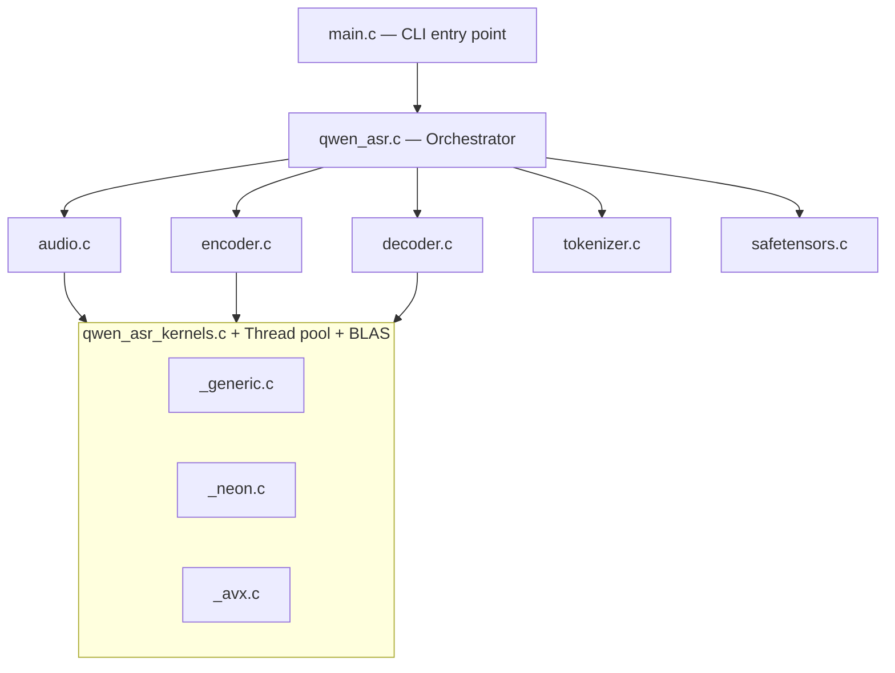

## Appendix C: File Dependency Graph

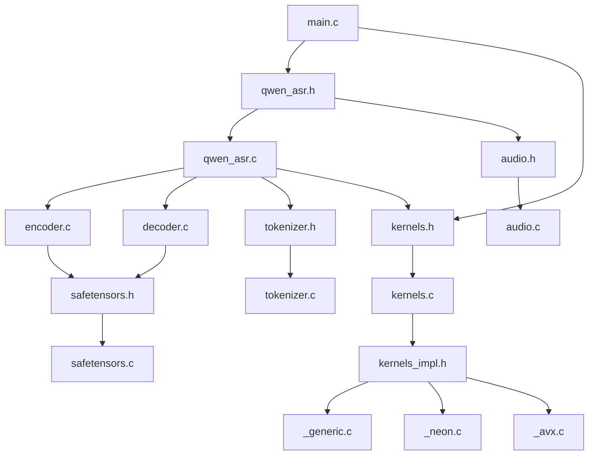

## Appendix D: Kernel Dispatch

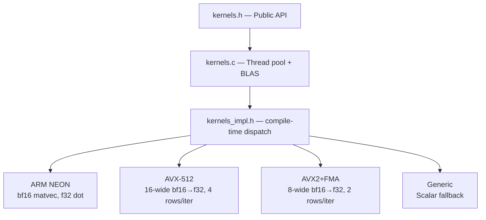

> **Decode bottleneck:** `qwen_bf16_matvec_fused` (memory-bound bf16×f32) + `qwen_argmax_bf16_range` (streaming argmax).
> **Encode bottleneck:** `cblas_sgemm` (f32 batch matmul via BLAS).

## Appendix E: Threading Model

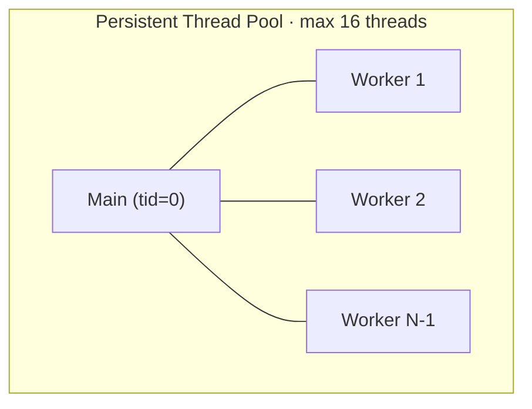

> `qwen_parallel_for`: broadcast → main runs tid=0 → wait all workers.
> Parallelized: bf16 matvec · argmax · QKV fused · attention head partitioning.
> BLAS uses its own separate OpenBLAS thread pool.

## Appendix F: Transcription Modes

**Mode 1: Offline** (default, `-S 0`)

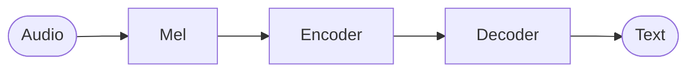

> Simplest path. Best quality for < 60s audio.

**Mode 2: Segmented** (`-S <seconds>`)

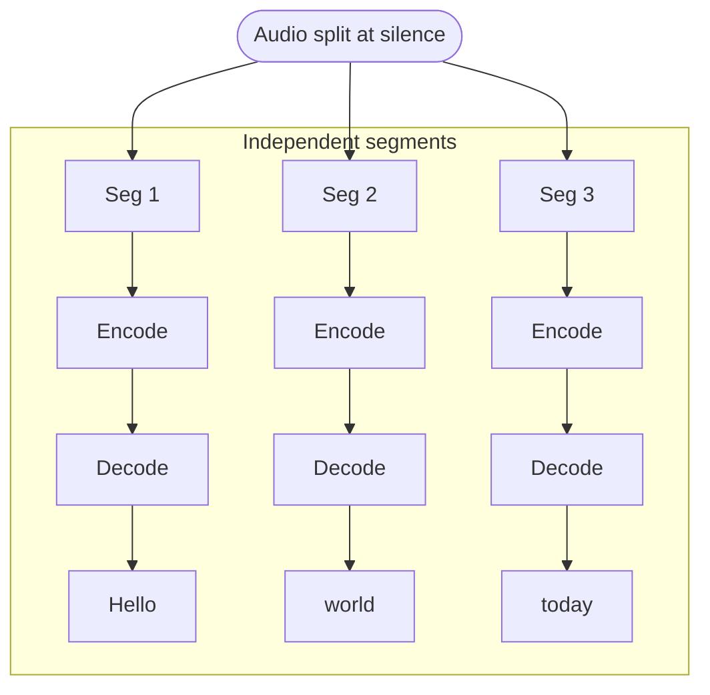

> `--past-text yes`: each segment conditions on prior text. Anti-collapse retry if output too short.

**Mode 3: Streaming** (`--stream`)

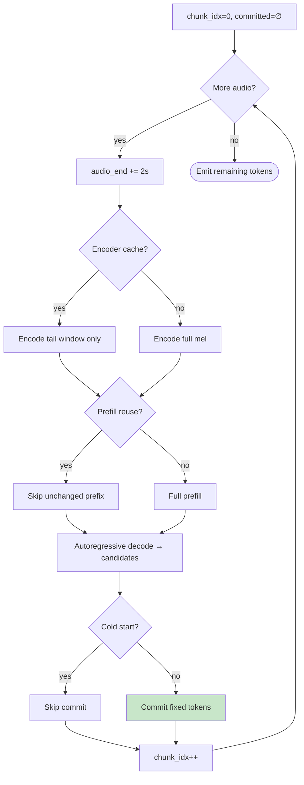

> **Encoder cache** (only re-encode tail window) · **Prefill reuse** (skip unchanged KV) · **Rollback** (last 5 tokens unfixed) · **Monotonic commit** (never retract).

## Appendix G: Key Design Decisions

| Decision | Why |
|----------|-----|
| **bf16 mmap decoder, f32 malloc encoder** | Decoder does matvecs (SIMD bf16). Encoder does batch matmul (BLAS needs f32). |
| **Fused gate+up weights** | One matvec instead of two for SwiGLU. Halves memory traffic. |
| **Streaming argmax** | No 600KB logits buffer. Argmax while scanning rows. |
| **Tied embeddings** | `lm_head = tok_embeddings^T`. Saves ~300MB. |
| **Per-chunk sinusoidal PE** | Chunks are independent — each starts at pos=0. |
| **Brute-force DFT** | N=400 is small enough. Simpler than FFT. |
| **NeoX RoPE (split-half)** | `[x[:h]*cos - x[h:]*sin, x[:h]*sin + x[h:]*cos]` |
| **Persistent thread pool** | Avoids pthread_create/join per op. Workers sleep on condvar. |
